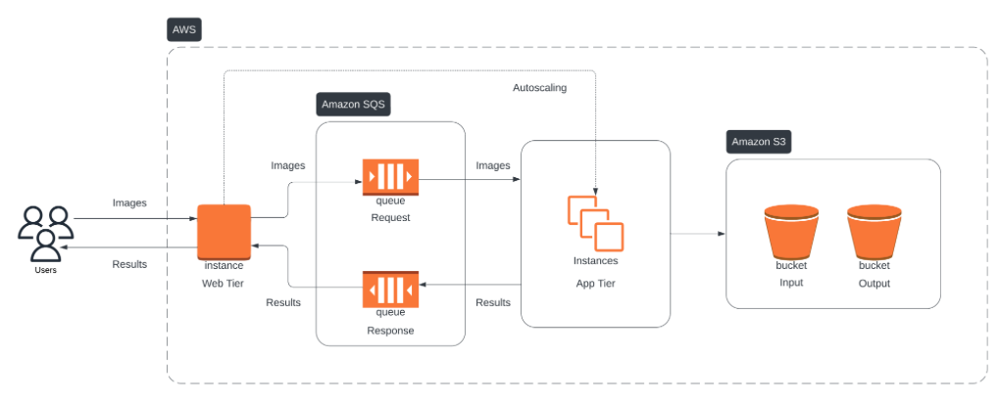

# Scalable-Face-Recognition-System

## Project Overview
This project is a scalable, multi-tier cloud application for face recognition using Amazon Web Services (AWS). The system is designed to handle concurrent requests, auto-scale according to the load, and process inputs efficiently. The application leverages EC2 instances, S3 buckets for storage, SQS queues for communication, and deep learning models using PyTorch for inference.

### Key Features
- **Multi-Tier Architecture**: Separation into web, app, and data tiers for modularity and scalability.
- **Auto-Scaling**: Custom algorithm to scale up to 20 EC2 instances based on request volume.
- **Deep Learning Model**: PyTorch-based model for accurate face recognition.
- **Persistent Storage**: Input images and classification results stored in S3 buckets.
- **Web Interaction**: `web_tier.py` script handles incoming HTTP POST requests to process images.

### Components
- **Web Tier**:
  - Managed by `web_tier.py`, which acts as a Flask-based server to receive and process POST requests containing image files.
  - Communicates with SQS queues to forward requests to the app tier and handles auto-scaling operations.
- **App Tier**:
  - Deployed on EC2 instances with a custom AMI running `app_tier.py`.
  - Processes image requests using a PyTorch model and sends results back to the web tier.
- **Data Tier**:
  - Uses S3 buckets to persistently store input images and output results.

### Project Files
- `web_tier.py`: Handles incoming POST requests, manages SQS queues, initiates auto-scaling, and interacts with EC2 instances. **(Placed in `web-tier/`)**
- `face_recognition.py`: PyTorch-based code for handling image inference. **(Placed in `app-tier/`)**
- `app_tier.py`: Manages the app tier operations, including processing requests and returning results. **(Placed in `app-tier/`)**